# Schedule Manager

A modern, mobile-first scheduling application built for small businesses to efficiently manage workers, jobs, and schedules. Originally developed for a truck bed lining company to streamline their daily operations and worker allocation.

## � Project Status

> **Note**: This project was created as a practice exercise to learn SvelteKit, MongoDB, and other modern web technologies. It was completed in about 2 weeks over the course of a month and is **no longer maintained as of June 2024**. The codebase serves as a demonstration of full-stack development skills and real-world application architecture.

## �🚀 Features

- **📱 Mobile-First Design**: Optimized for mobile devices to manage schedules on-the-go
- **👥 Worker Management**: Add, edit, and manage employee information and daily hour limits
- **📋 Job Tracking**: Create and manage jobs with estimated hour requirements
- **📅 Smart Scheduling**: Automatic event scheduling with intelligent time slot allocation
- **🔒 Company-Based Access**: Secure login system using company-specific credentials
- **📊 Calendar Views**: Multiple calendar views (Day, Week, Month, List) for schedule visualization
- **⏰ Break Management**: Automatic lunch break consideration in scheduling
- **🎨 Color-Coded Events**: Visual organization with customizable event colors

## 📸 Screenshots

### 📅 Calendar Views

| Day View | Week View |
|----------|-----------|
| 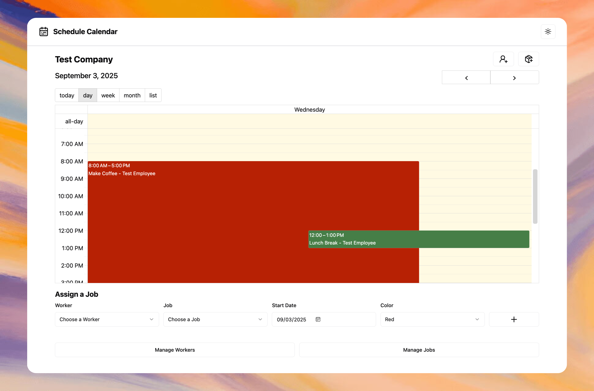 | 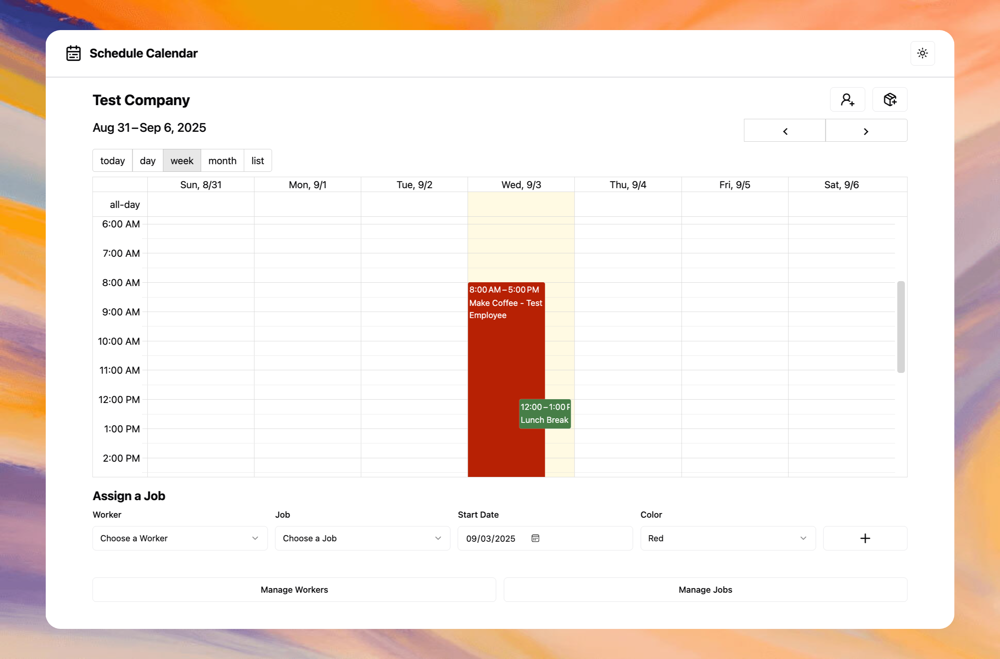 |
| _Day view showing detailed hourly schedule with worker assignments_ | _Week view for broader schedule planning across multiple days_ |

| Month View | List View |
|------------|-----------|
| 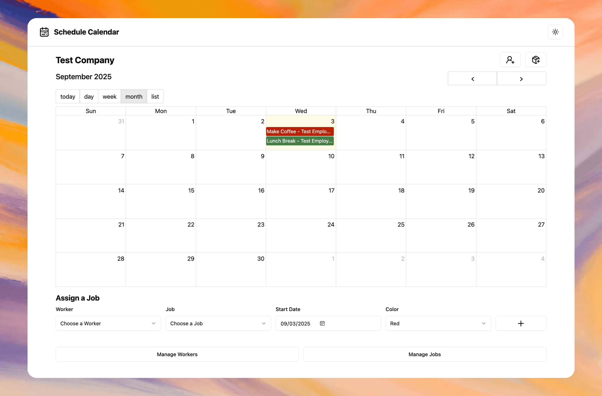 | 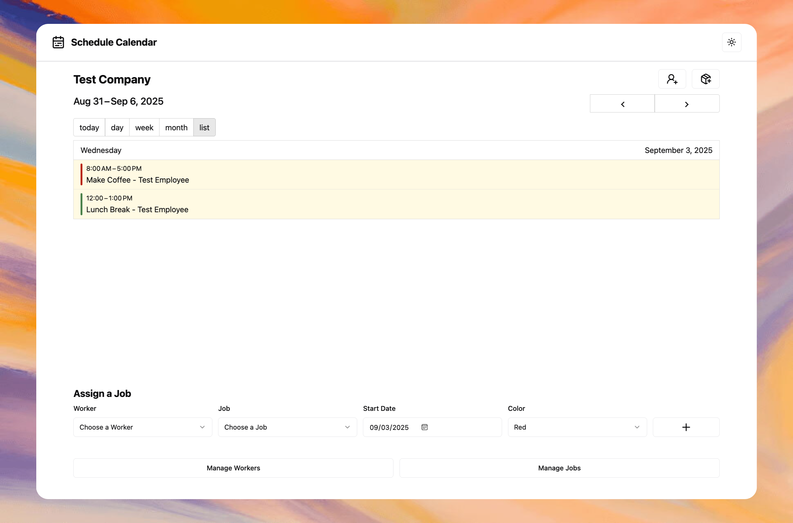 |
| _Month view for long-term schedule overview and planning_ | _List view for chronological event display_ |

### 👥 Worker Management

| Manage Workers | Create Worker | Edit Worker |
|----------------|---------------|-------------|
| 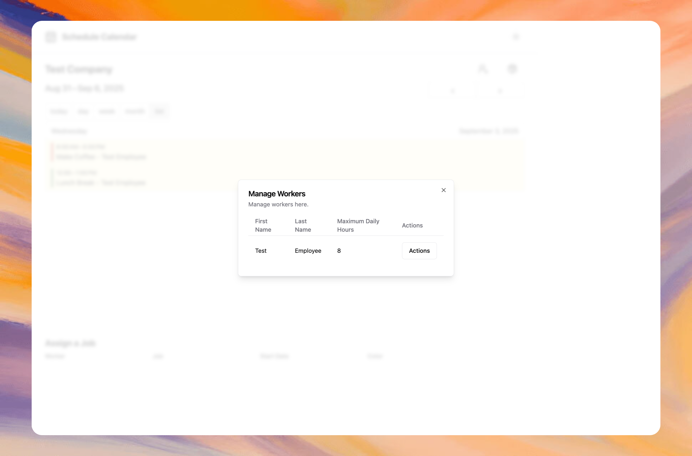 | 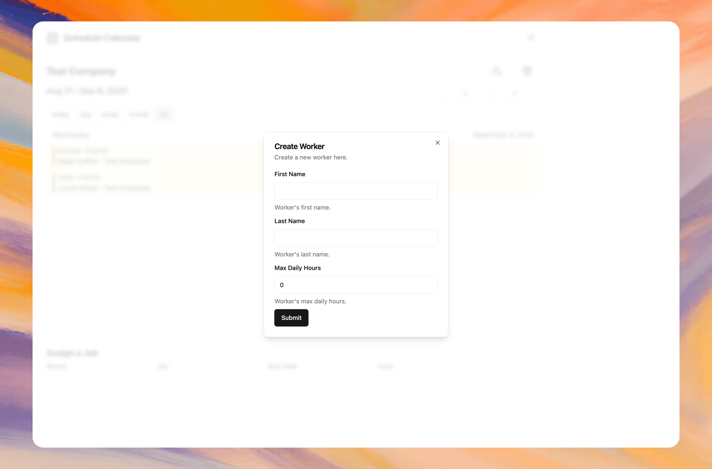 | 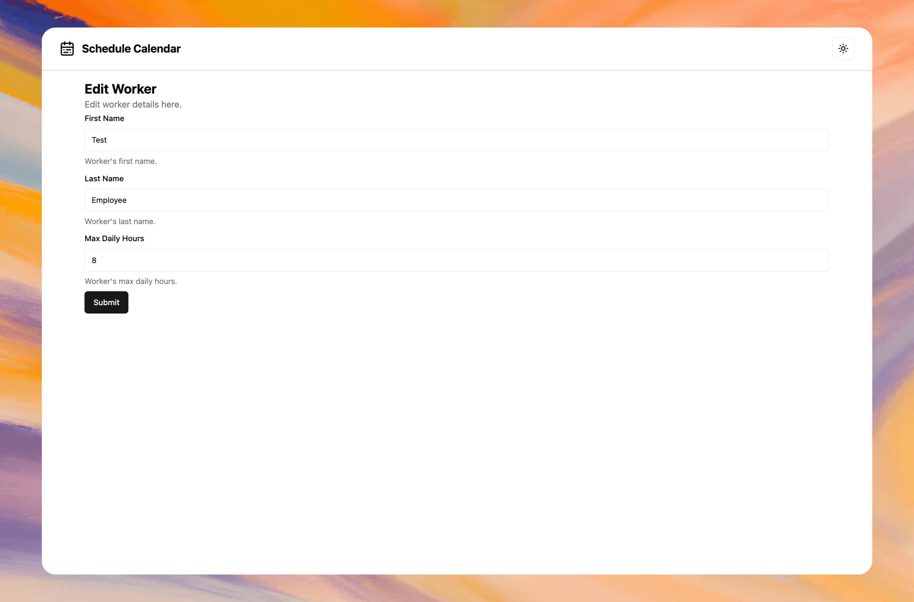 |
| _Worker management interface showing all employees_ | _Worker creation form with daily hour limits_ | _Worker editing interface for updating employee details_ |

### 📋 Job Management

| Manage Jobs | Create Job | Edit Job |
|-------------|------------|----------|
| 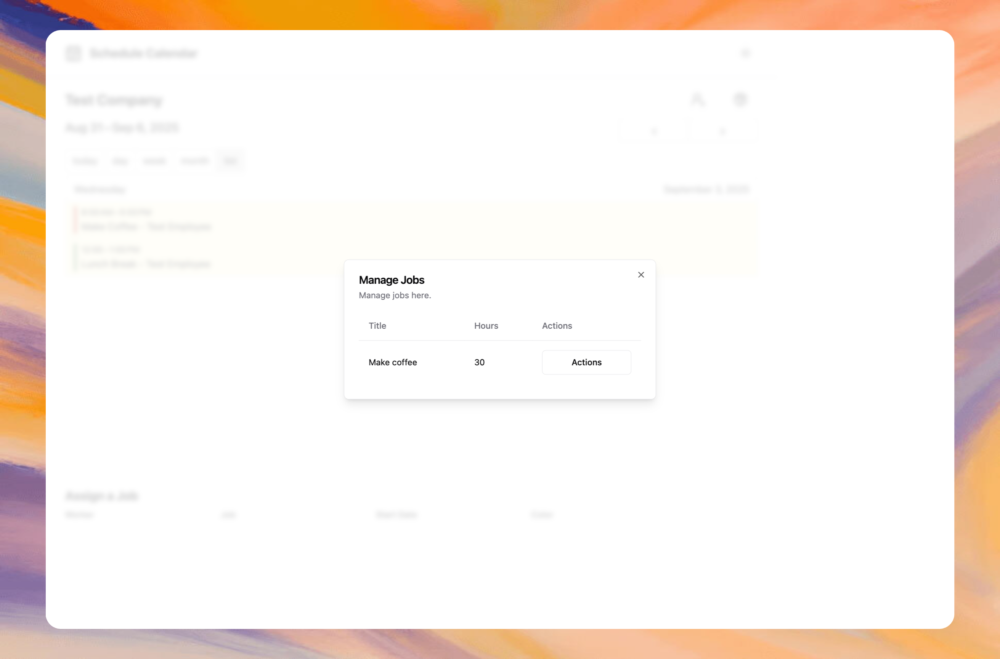 | 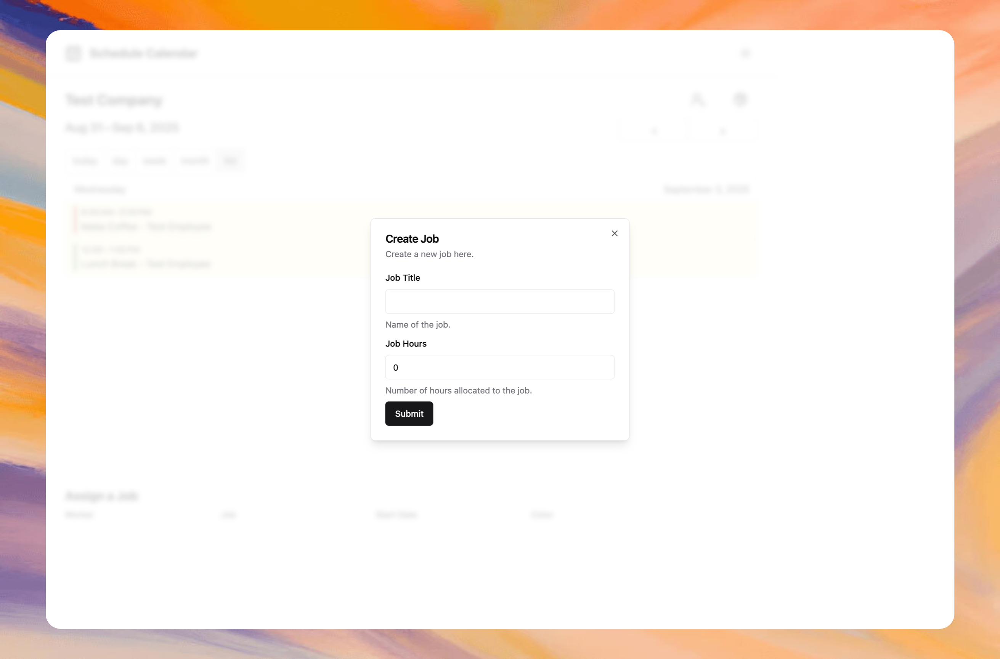 | 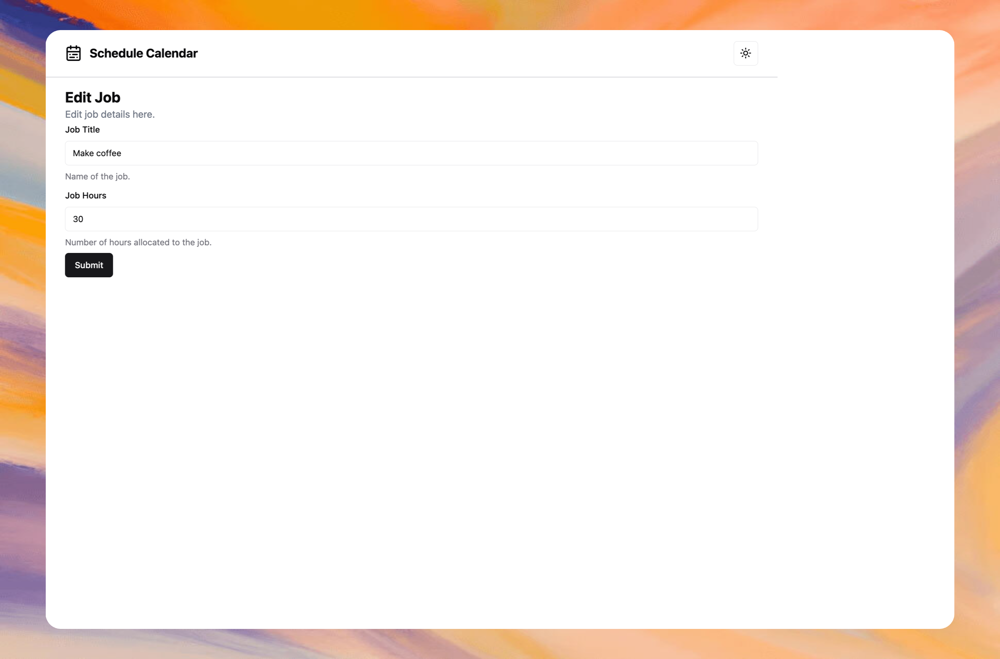 |
| _Job management interface showing all available projects_ | _Job creation form with hour estimation and project details_ | _Job editing interface for updating project information_ |

### 📱 Mobile Interface

| Mobile View |
|-------------|
| 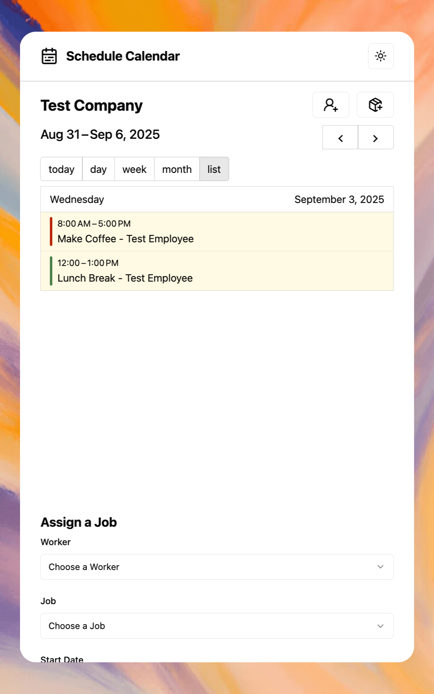 |
| _Mobile-optimized interface for on-the-go schedule management_ |

## 🛠️ Tech Stack

- **Frontend**: SvelteKit with TypeScript
- **Build Tool**: Vite for fast development and optimized builds
- **Styling**: TailwindCSS with shadcn/ui components (built on bits-ui)
- **Database**: MongoDB with Prisma ORM
- **Calendar**: Event Calendar library for interactive scheduling views
- **Forms**: Superforms with Zod validation and Formsnap integration
- **UI Components**: bits-ui for accessible component primitives
- **Icons**: Lucide Svelte for consistent iconography
- **Notifications**: Svelte Sonner for toast messages
- **Flash Messages**: SvelteKit Flash Message for user feedback
- **Theme Management**: Mode Watcher for dark/light mode support
- **Code Quality**: ESLint and Prettier for code formatting and linting

## 🏗️ Architecture

### Database Schema

- **Company**: Multi-tenant support with company-specific logins
- **Employee**: Worker information with configurable daily hour limits
- **Job**: Project tracking with estimated hours and worker assignments
- **Event**: Calendar events linking workers to jobs with time tracking

### Key Features

- **Intelligent Scheduling**: Automatically finds available time slots considering:
  - Existing worker schedules
  - Daily hour limits
  - Lunch break requirements (12-1 PM)
  - Weekday-only scheduling
- **Mobile Responsive**: Designed mobile-first for field use
- **Real-time Updates**: Form validation and instant feedback
- **Flexible Calendar**: Multiple view modes for different planning needs

## 🚀 Getting Started

### Prerequisites

- Node.js 18+
- pnpm (recommended) or npm
- MongoDB database

### Installation

1. **Clone the repository**

   ```bash
   git clone https://github.com/adamsanclemente/Schedule-Manager.git
   cd Schedule-Manager
   ```

2. **Install dependencies**

   ```bash
   pnpm install
   ```

3. **Set up environment variables**

   ```bash
   cp .env.example .env
   # Configure your DATABASE_URL in .env
   ```

4. **Set up the database**

   ```bash
   npx prisma generate
   npx prisma db push
   npx prisma db seed  # Optional: adds sample data
   ```

5. **Start the development server**

   ```bash
   pnpm dev
   ```

6. **Access the application**
   Open [http://localhost:5173](http://localhost:5173) in your browser

### Sample Login

After running the seed script, you can log in with:

- Company Login: `testcompany`

## 📱 Usage

### For Business Owners/Managers

1. **Access Your Schedule**: Enter your company login on the homepage
2. **Manage Workers**: Add employees with their daily hour limits
3. **Create Jobs**: Define projects with estimated hour requirements
4. **Schedule Work**: Assign workers to jobs - the system automatically finds optimal time slots
5. **Monitor Progress**: Use calendar views to track scheduled work and availability

### Key Workflows

**Adding a New Worker:**

1. Click "Manage Workers" → "Create Worker"
2. Enter first name, last name, and daily hour limit
3. Worker is immediately available for job assignments

**Creating and Scheduling a Job:**

1. Click "Create Job" and specify title and total hours
2. In the "Assign a Job" section, select worker, job, and start date
3. System automatically schedules work across available days

**Viewing Schedules:**

- Switch between Day/Week/Month/List views
- Click events to view details or make modifications
- Color-coded events for easy visual organization

## 🚀 Deployment

### Security Notice

⚠️ **Important**: This application was not built following strict security guidelines and is completely meant to be locally hosted and secured externally. Do not deploy to public environments without implementing proper security measures.

### Deployment Options

#### Docker (Recommended for Local)

```bash
# Build and run with Docker
docker build -t schedule-manager .
docker run -p 3000:3000 schedule-manager
```

#### Vercel

Deploy with MongoDB Atlas for a cloud solution:

1. Connect your GitHub repository to Vercel
2. Set up MongoDB Atlas and configure the DATABASE_URL
3. Deploy directly from the Vercel dashboard

## 🤝 Contributing

This project was built as a business solution but is open for improvements:

1. Fork the repository
2. Create a feature branch (`git checkout -b feature/improvement`)
3. Commit changes (`git commit -m 'Add new feature'`)
4. Push to branch (`git push origin feature/improvement`)
5. Open a Pull Request

## 📄 License

This project is licensed under the MIT License - see the [LICENSE](LICENSE) file for details.

## 📞 Contact

### Adam Sanclemente

- GitHub: [@adamsanclemente](https://github.com/adamsanclemente)
- LinkedIn: [Adam Sanclemente](https://linkedin.com/in/adamsanclemente)
- Email: [abombsc@gmail.com](mailto:abombsc@gmail.com)

## 🙏 Acknowledgments

- Built for a local truck bed lining company's scheduling needs
- shadcn/ui for beautiful, accessible components
- SvelteKit team for the excellent framework
- Prisma for the type-safe database layer

---

_This application demonstrates modern web development practices including TypeScript, responsive design, database modeling, and real-world business logic implementation._
